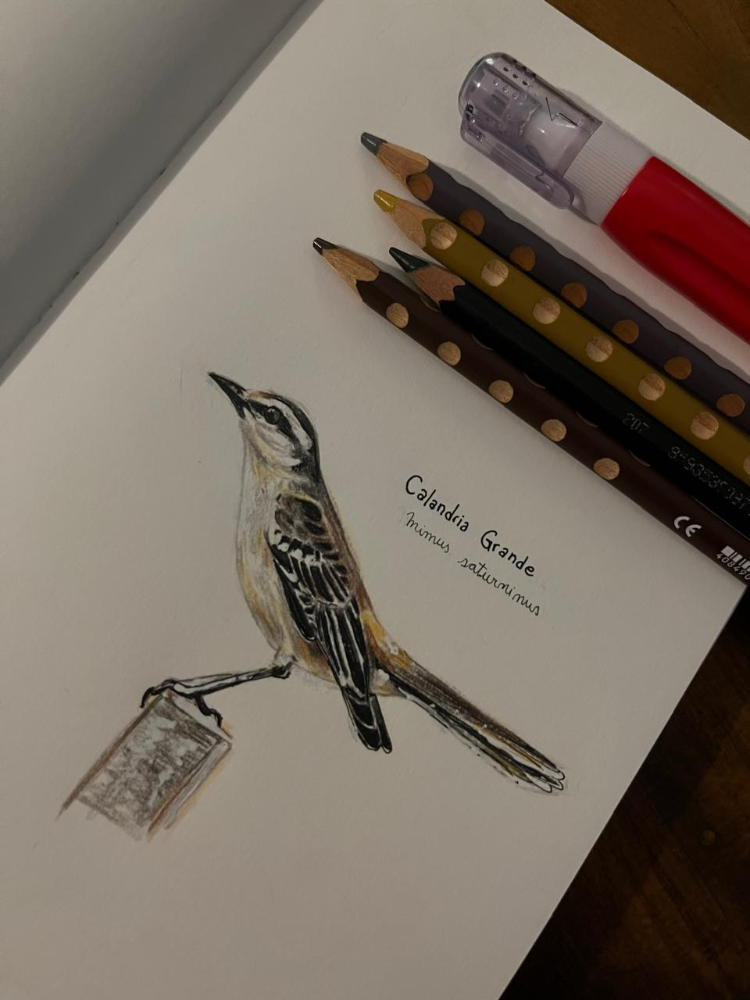

# Julia Rojas

Buenas!

Soy Julia, estudiante de la carrera Licenciatura en Sistemas, UNLP. Me encuentro en el último eslabón de la carrera, escribiendo el informe final de mi tesina, luchando con el marco referencial, pero con el desarrollo del sistema listo (forzadamente listo) y la propuesta aprobada.

Fui bailarina de danzas clásicas hasta el año pasado, habiendo participado como bailarina de refuerzo en Romeo y Julieta 2025, en el Teatro Argentino de La Plata. 
También soy ayudante en la facu. Desde 2024 en Redes y Comunicaciones, y de 2022 a 2026 en CADP.

Tengo muchos y variados intereses, como la lectura, el cine, el dibujo, la música y la escritura.

Adjunto foto de mi último dibujo, una Calandria grande, de mi colección de aves que vi en mi ciudad (La Plata).

Y un gran disco de una gran banda, de nada.  
https://youtube.com/playlist?list=OLAK5uy_l5QWiCxD1Y-gp0EA7jGrO3dO8xIUgA2No&si=sJyOY4im-m2B58D6